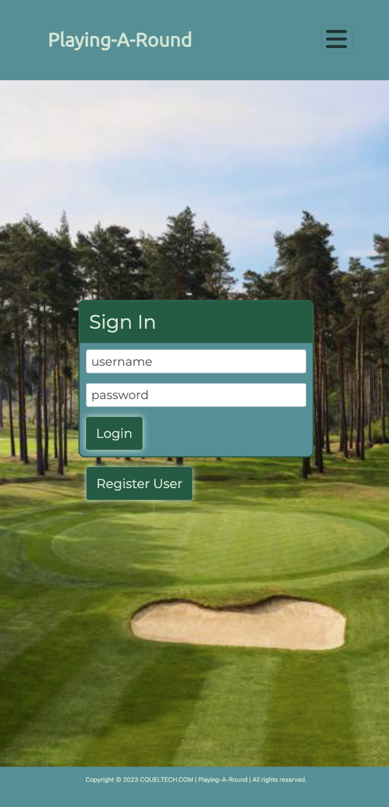

# Playing-A-Round

The online Playing-A-Round Spring Boot web application is a golf scorecard, statistics and GPS ranging solution. It instantly calculates scores, handicaps, stableford and daytona points, matchplay standings, and longest drive distances for all players involved in a round of golf.

|Screenshot 1|Screenshot 2|Screenshot 3|
|------|--------|-----------|
||||

Playing-A-Round is ideally suited for large groups on a golf outing. Players are organised into teams of one or two for a game. Scores for the group are tracked in realtime allowing each user to monitor scores and stats for every player/team. A user can see how they are fairing and ultimately which player/team wins in each supported scoring format.

Should a particular golf course not exist in the server database a user has the ability to add the course statistics to the database via the app. On completion of a round a players course handicap will be calculated and used to determine their overall handicap as set out by the World Handicap System 2020.

This GitHub repository contains all code relating to both server and client sides of the application as well as .sql scripts for database setup, triggers, and stored functions and procedures.

